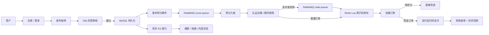
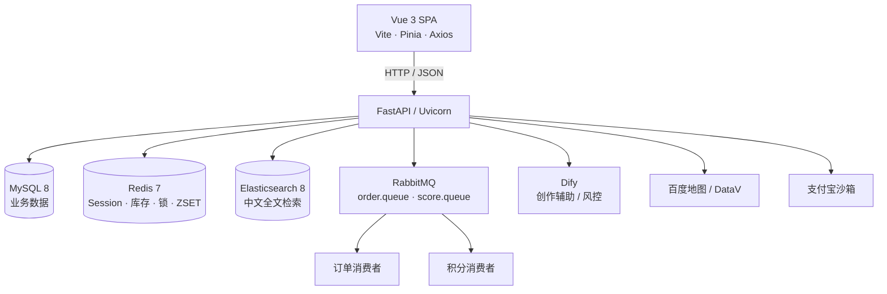

# 风瞳 Fengtong

> 面向内容发布场景的智能风控新闻平台  
> AI 内容辅助 · 智能审核 · 中文检索 · 地图浏览 · 积分商城 · 高并发抢购 · 支付闭环
> 
> 演示视频：(https://live.csdn.net/v/540311?spm=1001.2014.3001.5501)

风瞳不是一个单纯的新闻展示站，而是一个围绕风控设计的全栈 Web 应用：创作者发布内容后，由 AI 风控工作流参与审核；通过审核的内容会进入搜索与地图浏览体系，并触发积分激励；用户可将积分用于礼品兑换或限时抢购，含现金的订单通过支付宝扫码支付完成闭环。

## 项目亮点

| 场景    | 方案                                 | 解决的问题                           |
| ----- | ---------------------------------- | ------------------------------- |
| 内容审核  | Dify 工作流风控 + 人工审核兜底                | 将高风险内容保留为待审核，普通内容自动通过并记录风险等级。   |
| 中文检索  | Jieba 搜索模式分词 + Elasticsearch 双字段召回 | 改善中文长文本按字切分造成的召回与高亮质量问题。        |
| 抢购防超卖 | Redis Lua 原子扣减 + RabbitMQ 排队消费     | 将“查库存—扣库存”变为原子操作，削平瞬时并发。        |
| 积分一致性 | RabbitMQ 异步积分事件 + Redis 防重锁        | 点赞、收藏、评论、发布等积分事件可异步处理并降低重复计分风险。 |
| 支付可靠性 | 主动查单 + 支付宝异步验签通知 + 超时扫描            | 支付完成、网络中断和订单超时三类路径都有状态兜底。       |
| 超时订单  | Redis ZSET 定时调度                    | 仅扫描已过期订单；取消前主动查支付状态，避免临界支付被误取消。 |
| 时间一致性 | 服务端时间偏移校准                          | 抢购倒计时基于服务端时间推算，降低客户端改时钟带来的误判。   |

## 核心业务闭环



## 架构



### 技术栈

| 层级     | 组件                                                                 |
| ------ | ------------------------------------------------------------------ |
| 前端     | Vue 3、TypeScript、Vite、Pinia、Vue Router、Axios、ECharts、TinyMCE       |
| 后端     | Python 3.11、FastAPI、SQLAlchemy、Pydantic、Uvicorn、python-jose、bcrypt |
| 数据与中间件 | MySQL 8、Redis 7、Elasticsearch 8、RabbitMQ 3                         |
| 搜索与异步  | Jieba、Elasticsearch、RabbitMQ、Redis Lua                             |
| 部署     | Docker Compose、Nginx                                               |
| 第三方服务  | Dify、支付宝、阿里云短信、百度地图                                                |

## 功能模块

| 模块    | 主要能力                                    |
| ----- | --------------------------------------- |
| 认证与账户 | 用户注册、密码登录、短信登录、JWT 双 Token、刷新、退出、手机号绑定。 |
| 新闻与风控 | 发布、风险等级识别、人工审核、详情、评论、点赞、收藏、我的发布。        |
| AI 创作 | 内容润色/辅助创作、结果保存、个人与管理端记录查看。              |
| 搜索与地图 | ES 全文搜索与高亮、地区统计、GeoJSON 行政区划、新闻地理标记。    |
| 积分    | 余额、明细、汇总；发布、互动、兑换、退款等来源的积分事件。           |
| 礼品与订单 | 礼品展示、积分/现金组合下单、取消、删除、订单管理。              |
| 限时抢购  | 活动管理、服务端时间校准、排队下单、Redis 库存预热与原子扣减。      |
| 支付    | 支付宝扫码预下单、异步通知验签、主动查单、超时取消与库存/积分回补。      |
| 管理后台  | 内容审核、用户统计、AI 记录、礼品与抢购活动管理。              |

## 目录说明

```text
fengtong/
├─ backend/
│  ├─ app/
│  │  ├─ routers/          # 认证、新闻、AI、商城、订单、支付、地图等 API
│  │  ├─ models/           # SQLAlchemy 数据模型
│  │  ├─ services/         # 库存、搜索、支付、消息消费、短信等服务
│  │  └─ utils/            # JWT、密码、Redis 工具
│  ├─ create_admin.py      # 交互式创建管理员
│  └─ requirements.txt
├─ frontend/user-app/      # Vue 3 SPA
├─ nginx/                  # 前端静态资源服务配置
├─ secrets/                # 本地 PEM 私钥目录，只保留 .gitkeep
├─ docker-compose.yml      # 基础编排
├─ docker-compose.alipay.yml.example
├─ .env.example            # 环境变量模板
└─ README.md
```

## 快速开始

### 前置条件

- Docker Desktop 及 Docker Compose（推荐）。
- 如需本地开发：Python 3.11、Node.js 22，以及可用的 MySQL、Redis、Elasticsearch、RabbitMQ。
- 如需 AI、短信、地图、支付功能：对应平台的有效凭据与已开通服务。

### 1. 创建本地配置

项目不包含真实配置。复制模板后编辑：

```powershell
Copy-Item .env.example .env
notepad .env
```

必须替换所有 CHANGE_ME_* 值，尤其是 DB_PASSWORD、RABBITMQ_PASSWORD、JWT_SECRET_KEY 和 ADMIN_INVITE_CODE。可以用 PowerShell 生成 JWT 密钥：

```powershell
$bytes = New-Object byte[] 48
[System.Security.Cryptography.RandomNumberGenerator]::Create().GetBytes($bytes)
[Convert]::ToBase64String($bytes)
```

### 2. 使用 Docker 启动

```powershell
docker compose up -d --build
docker compose ps
```

首次启动时，后端会创建 ORM 数据表、初始化 Elasticsearch 索引、预热 Redis 库存，并启动积分、订单与超时处理任务。

| 服务               | 本机地址                             | 说明                |
| ---------------- | -------------------------------- | ----------------- |
| Web 前端           | http://localhost:3000            | Nginx 托管的 Vue SPA |
| 后端 API / Swagger | http://localhost:8000/docs       | OpenAPI 在线文档      |
| 健康检查             | http://localhost:8000/api/health | 后端健康状态            |
| MySQL            | localhost:3307                   | 容器内端口为 3306       |
| Redis            | localhost:6379                   | 缓存、会话、库存、定时任务     |
| Elasticsearch    | http://localhost:9200            | 全文检索              |
| RabbitMQ 管理台     | http://localhost:15672           | 队列与消费者观察          |

常用运维命令：

```powershell
docker compose logs -f backend
docker compose logs -f backend_consumer
docker compose down
```

### 3. 创建管理员

基础服务启动后，执行以下命令并按提示输入账号与至少 12 位密码：

```powershell
docker compose exec backend python create_admin.py
```

也可以通过注册接口结合 ADMIN_INVITE_CODE 注册管理员；生产环境推荐限制管理员注册入口，并定期轮换邀请码。

## 配置参考

所有变量都已写入 .env.example。下面是按用途的说明。

| 分类    | 变量                                                                                                 | 必要性     | 配置要点                                  |
| ----- | -------------------------------------------------------------------------------------------------- | ------- | ------------------------------------- |
| 数据库   | DB_HOST、DB_PORT、DB_USER、DB_PASSWORD、DB_NAME                                                        | 必须      | Compose 内主机名是 mysql；生产环境使用独立账号和高强度密码。 |
| 缓存    | REDIS_HOST、REDIS_PORT                                                                              | 必须      | Compose 内主机名是 redis。                  |
| 搜索    | ES_HOST、ES_URL                                                                                     | 必须      | Compose 内主机名是 elasticsearch。          |
| 消息队列  | RABBITMQ_HOST、RABBITMQ_PORT、RABBITMQ_USER、RABBITMQ_PASSWORD                                        | 必须      | 用于订单排队和积分异步消费，禁止沿用默认密码。               |
| 认证    | JWT_SECRET_KEY、JWT_EXPIRE_MINUTES、REFRESH_TOKEN_EXPIRE_DAYS                                        | 必须      | JWT 密钥必须随机生成；泄漏后立即轮换。                 |
| 管理与跨域 | ADMIN_INVITE_CODE、CORS_ORIGINS、DEBUG                                                               | 建议      | 生产环境设置可信前端域名、DEBUG=false。             |
| Dify  | DIFY_CREATIVE_API_KEY、DIFY_RISK_API_KEY、DIFY_API_URL                                               | 使用 AI 时 | 创作与风控工作流可使用不同密钥。                      |
| 短信    | ALIBABA_CLOUD_ACCESS_KEY_ID、ALIBABA_CLOUD_ACCESS_KEY_SECRET、SMS_TEMPLATE_LOGIN、SMS_TEMPLATE_CHANGE | 使用短信时   | 使用最小权限 RAM 凭据。                        |
| 地图    | BAIDU_MAP_AK                                                                                       | 使用地理编码时 | 在平台侧为密钥设置来源限制。                        |
| 支付    | ALIPAY_APP_ID、ALIPAY_GATEWAY、ALIPAY_REDIRECT_URI、ALIPAY_NOTIFY_URL                                 | 使用支付时   | 生产回调地址必须使用 HTTPS。                     |
| 订单    | PAYMENT_WINDOW_MINUTES                                                                             | 可选      | 现金订单的支付超时分钟数，默认 15。                   |

## 可选能力配置

### 支付宝

基础编排不挂载支付宝私钥，未配置支付也可体验其它功能。启用支付宝沙箱或生产支付时：

```powershell
Copy-Item docker-compose.alipay.yml.example docker-compose.alipay.yml
New-Item -ItemType Directory -Force secrets
```

将自己的密钥文件放到以下路径：

```text
secrets/alipay_private_key.pem
secrets/alipay_public_key.pem
```

再使用覆盖配置启动：

```powershell
docker compose -f docker-compose.yml -f docker-compose.alipay.yml up -d --build
```

同时填写 .env 中的支付宝 App ID、网关和回调地址。secrets 目录与本地 docker-compose.alipay.yml 默认不会被 Git 提交。

### 本地前后端开发

先准备 MySQL、Redis、Elasticsearch、RabbitMQ，并将 .env 中的主机名改为本机可访问的地址。后端在项目根目录启动，以便读取根目录 .env：

```powershell
python -m venv .venv
.\.venv\Scripts\Activate.ps1
pip install -r backend\requirements.txt
$env:PYTHONPATH = "$PWD\backend"
python -m uvicorn app.main:app --host 0.0.0.0 --port 8000 --reload
```

另开终端运行前端：

```powershell
Set-Location frontend\user-app
npm ci
npm run dev
```

Vite 已将 /api 请求代理到 http://localhost:8000。

## 关键设计说明

### 内容审核与激励

新闻发布后，风控工作流给出高、中、低、正常等审核结果。高风险内容保留为待审核；通过内容写入 Elasticsearch，并发布积分事件。积分消费者借助 Redis 防重锁写入积分流水和余额，避免同步处理拖慢发布接口。

### 抢购与库存

抢购请求写入 order.queue，订单消费者以 prefetch_count=1 消费。库存的读取、判断与扣减由 Redis Lua 脚本在服务端原子执行；应用启动会将上架礼品和有效活动库存预热到 Redis。订单结果写入 Redis，前端以轮询方式获取排队结果。

### 支付与超时回补

纯积分订单直接完成；含现金订单进入支付宝扫码流程。系统同时使用前端主动查单与支付宝异步通知。待支付订单写入 Redis ZSET order:timeout，扫描器发现超时订单后先向支付宝查单，再决定取消订单或标记支付成功；取消时回补库存和积分。

### 搜索与地图

内容会先清理 HTML/实体，再以 Jieba 搜索模式切词，写入 Elasticsearch 的分词字段；查询时采用标题和正文双路召回并返回高亮。新闻通过审核时可调用地理编码，将位置文本转换为经纬度，为地图标记和区域统计提供数据。

## API 导航

完整接口、请求参数和调试入口请访问 /docs。主要前缀如下：

| 前缀                                                 | 用途                       |
| -------------------------------------------------- | ------------------------ |
| /api/auth                                          | 注册、登录、刷新 Token、短信登录、个人资料 |
| /api/news                                          | 新闻发布、审核结果、互动、评论、统计       |
| /api/ai                                            | 创作辅助与记录                  |
| /api/search、/api/map                               | 搜索、地区统计、地图数据             |
| /api/score、/api/gifts、/api/flash-sales             | 积分、礼品、抢购                 |
| /api/orders、/api/alipay                            | 订单与支付                    |
| /api/admin、/api/admin/gifts、/api/admin/flash-sales | 管理端能力                    |

# 
